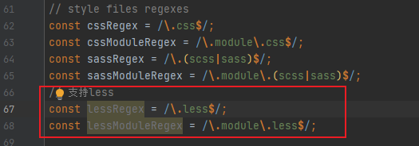

# 基础插件安装
yarn add react-router-dom axios less less-loader@4.0.1 antd

# 引入Less
1. ### `yarn eject`  暴露webpack
2. 找到 config/webpack.config.js 在其中添加一以下代码

3. 找到 getStyleLoaders 方法,添加以下代码

4. 最后找到如下代码处,添加less支持

5. ###`yarn start` 重启项目